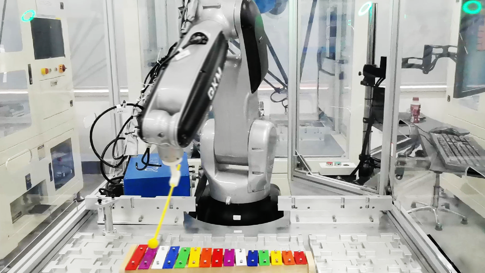
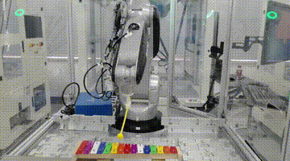

# Robotic Xylophonist

## Description
Play the xylophone using a six-axis robotic arm. 
The project's code, hosted on [GitHub](https://github.com/ZhengzheXu/robotic_xylophonist), 
provides a comprehensive implementation of the robotic xylophonist.
The codebase includes modules for:

- Musical score interpretation
- Cartesian path generation
- Hermite interpolation for trajectory planning
- Inverse kinematics solution for joint trajectories

## Requirements
- MATLAB

## Demo

Watch the robotic xylophonist playing Canon in D Major on [YouTube](https://youtu.be/YF2_2gfzfpQ). 

## License

This project is licensed under the [MIT License](LICENSE).